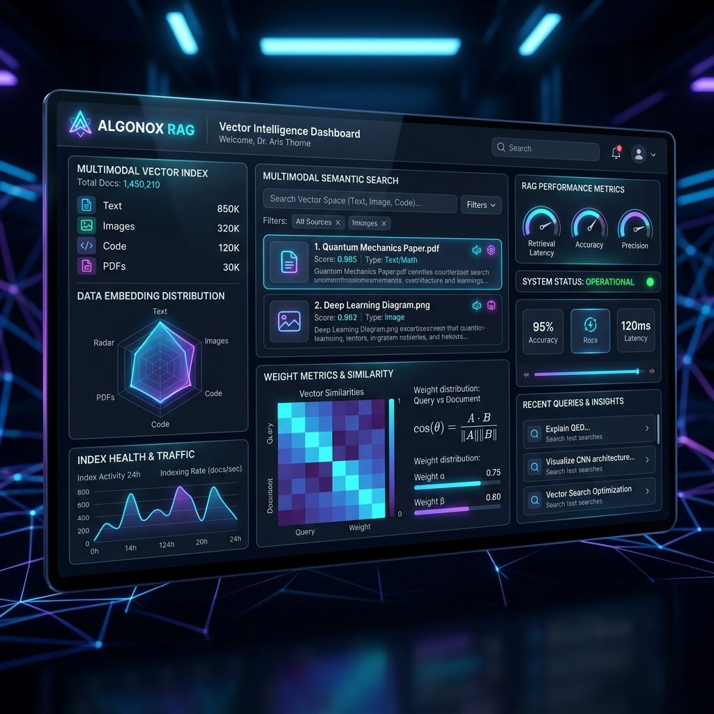
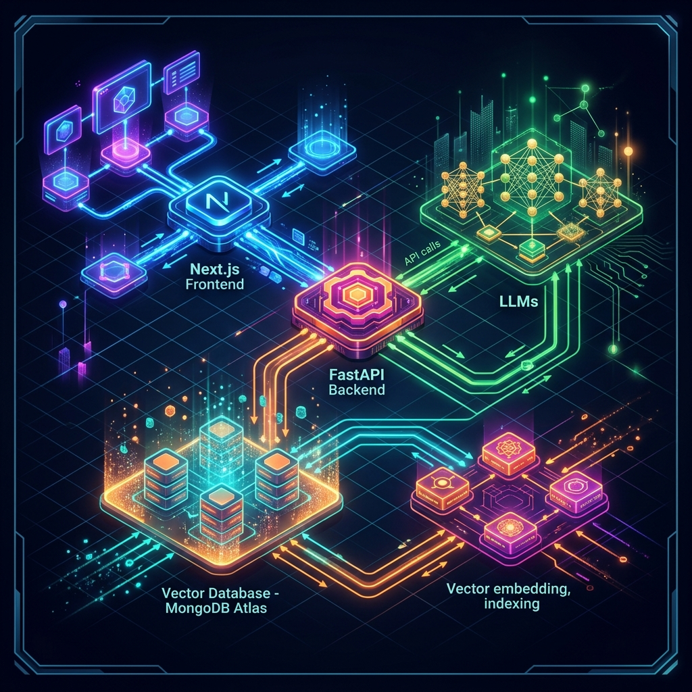

# 🌌 ALGONOX RAG: Enterprise-Grade Multimodal Grounded Document Intelligence

Algonox RAG (codename: **RAGINI**) is a premium, state-of-the-art Multimodal Retrieval-Augmented Generation & Intelligent Scraping Engine. Equipped with mathematically calibrated multi-portal search scraping, variable-length semantic chunking, dense vector indexes, and integrated AI-assisted mail routing triage, it represents the cutting-edge of enterprise document intelligence.

---

## 🎨 System Walkthrough & UI Design

### 💻 Enterprise Workspace Dashboard

*Modern dark-mode glassmorphic user interface offering contextual multimodal chat feeds, side-by-side session pinning, dynamic PDF indexing, and full control over document context boundaries.*

### 🛠️ Ingestion & Reranking Architecture

*High-performance concurrent scraping pipelines feeding MongoDB Atlas Vector Store, powered by Groq LLMs and semantic reranking indexes.*

---

## 🚀 Two Ways to Deploy on Render

Render provides two methods for deploying your application. We strongly recommend **Method A (Blueprint)** as it deploys both services together "in one go" and manages all routing automatically.

---

### ⚡ METHOD A: Deploy "In 1 Go" (Recommended Blueprint Deployment)

We have pre-configured a standard Render Blueprint spec file: [`render.yaml`](./render.yaml). This acts as a pipeline orchestrator. Instead of manually filling in paths, build commands, and start commands for separate services, **Render reads this file and configures everything in one click.**

#### How to use it:
1. Push all code to your GitHub Repository.
2. Go to the [Render Dashboard](https://dashboard.render.com/) and click **New +** -> **Blueprint**.
3. Connect your GitHub repository.
4. Render will parse the `render.yaml` file automatically and spin up both services in one go!
5. In the Render web form, simply fill in the secret API keys (e.g., `MONGODB_URI`, `GROQ_API_KEY`, etc.) and click **Apply**.

---

### 🛠️ METHOD B: Manual Setup (Separate Project Inputs)

If you prefer to configure your services manually in the Render dashboard instead of using the automated blueprint, here are the exact parameters and commands to enter in the input fields for both services:

#### 1. Backend Web Service (FastAPI)
*   **Service Type:** Web Service
*   **Name:** `algonox-rag-backend`
*   **Environment:** `Python`
*   **Root Directory (Folder):** `backend`  *(⚠️ Enter this in the "Root Directory" field!)*
*   **Build Command:** `pip install -r requirements.txt`
*   **Start Command:** `uvicorn main:app --host 0.0.0.0 --port $PORT`
*   **Environment Variables to Add:**
    *   `PORT`: `8000`
    *   `MONGODB_URI`: *(Your MongoDB connection string)*
    *   `GROQ_API_KEY`: *(Your Groq API Key)*
    *   `REDIS_URL`: *(Your Upstash Redis connection string)*
    *   `REDIS_TOKEN`: *(Your Upstash Redis token)*
    *   `SCRAPER_API_KEY`: *(Your ScraperAPI Key)*
    *   `TAVILY_API_KEY`: *(Your Tavily API Key)*
    *   `MODEL_NAME`: `llama-3.3-70b-versatile`
    *   `EMBEDDING_MODEL`: `BAAI/bge-small-en-v1.5`
    *   `RERANK_MODEL`: `BAAI/bge-reranker-base`
    *   `TEMPERATURE`: `0`
    *   `TOP_P`: `0.1`

---

#### 2. Frontend Web Service (Next.js)
*   **Service Type:** Web Service
*   **Name:** `algonox-rag-frontend`
*   **Environment:** `Node`
*   **Root Directory (Folder):** `frontend` *(⚠️ Enter this in the "Root Directory" field!)*
*   **Build Command:** `npm install && npm run build`
*   **Start Command:** `npm run start`
*   **Environment Variables to Add:**
    *   `NEXT_PUBLIC_API_BASE_URL`: `https://algonox-rag-backend.onrender.com`  
        *(⚠️ This is your live Backend URL! If your backend was assigned a different URL, replace it here.)*

---

## ⚙️ Local Development Setup

To run this platform locally on your machine, follow these steps:

### 1. Bootstrapping the Backend
1. Navigate to the backend directory:
   ```bash
   cd backend
   ```
2. Create and activate a Python virtual environment:
   ```bash
   python -m venv .venv
   # On Windows:
   .venv\Scripts\activate
   # On macOS/Linux:
   source .venv/bin/activate
   ```
3. Install dependencies:
   ```bash
   pip install -r requirements.txt
   ```
4. Run the API development server:
   ```bash
   python main.py
   ```
   *The API will run locally at `http://localhost:8000`.*

### 2. Bootstrapping the Frontend
1. Navigate to the frontend directory:
   ```bash
   cd ../frontend
   ```
2. Install npm packages:
   ```bash
   npm install
   ```
3. Launch the Next.js development server:
   ```bash
   npm run dev
   ```
   *The user interface will run locally at `http://localhost:3000`.*

---

## 🛡️ License & Enterprise Terms
This codebase is private property. Licensed for enterprise use only under Algonox Standard Terms. Developed by DeepMind Partner Group.
